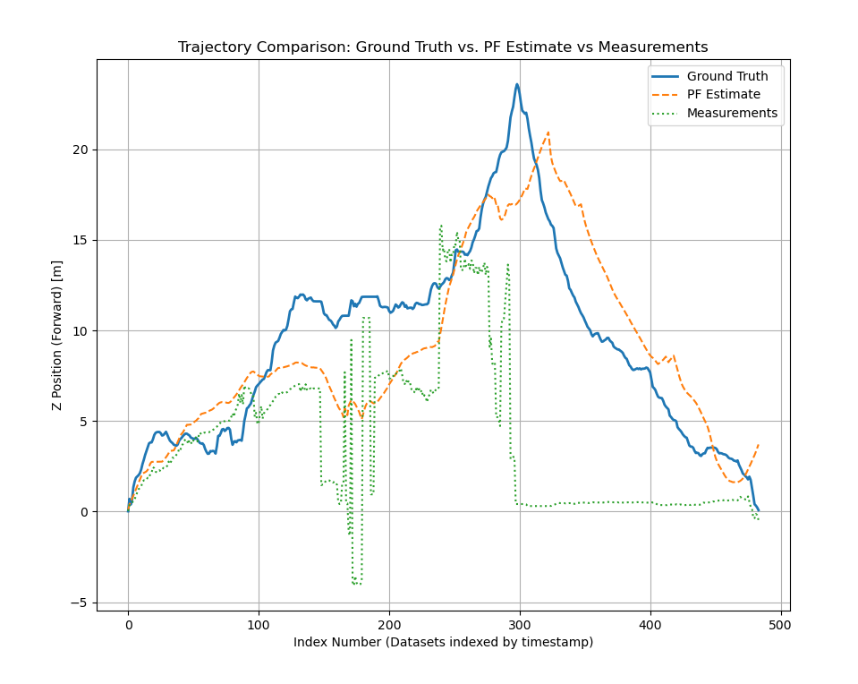

# Pose Estimator

## 📌 Project Overview
This repository contains the implementation of a **monocular pose estimator** designed for resource-constrained mobile robots. The goal is to estimate the relative pose of a moving front-facing camera using 
**feature matching, geometric transformations, and scale cues from known objects** detected on a rear-facing camera. This algorithm is designed for mobile robots without localization sensors like IMU or wheel accelerometers. 

The program takes two consecutive inputs from the rear-facing camera and computes the scaled real-world translation and orientation of the camera between frames. 

These relative pose measurements are then carefully aggregated to compute the absolute pose of the camera relative to its starting position. This absolute pose of the rear-facing camera is then convereted to the front facing 
camera using coordinate frame transformations and interpolation to account for frame capture time discrepancy between the front-facing camera and the rear facing camera.

The following relative pose measurements were selected to improve an AI-based depth estimator:
- **Relative Motion in Z** (longitudinal movement)
- **Pitch** (up/down camera tilt)
- **Roll** (sideways tilt)

The Absolute Position of the camera in Z-Axis was selected for improving the performance of the same AI-Based depth estimator linked in my [Depth Estimator Repository](https://github.com/dkadiry/pose-aware-monocular-depth-estimator).

### **Key Features:**
- Uses **SIFT feature matching** and **RANSAC** to estimate the essential matrix.
- Uses Object Bounding Boxes of known landmarks detected by YOLOv8 Model trained using Roboflow API. **[Roboflow Project Link](https://app.roboflow.com/damithesis-xdwvg/landmarkfinder/1)**   
- Uses Epipolar Geometry, Projective Transforation (Perspective Projection), Pinhole Camera Model, and known-landmark sizes to scale the normalized translation vector obtained from the essential matrix.
- Implements a **Particle filter** for pose refinement.
- Outputs **relative and absolute pose estimates** based on image sequences.
- When the object detector detects no landmark, the pose estimator uses the yaw measurement from the essential matrix and the motion model from the particle filter to estimate absolute pose.
    - This scenario is illustrated in the trajectory plot when the raw estimates (green) are hard-set to zero, and the final estimates still follow the expected trajectory based on ground truth.
 
## 🚀 Getting Started
1. Clone the repo and install dependencies.
2. Prepare a dataset with consecutive image pairs from a rear-facing camera.
3. Run the pose estimator script.
4. Run the particle filter script to refine pose estimates.
5. Generate the trajectory plot comparison (Plot generated in Particle Filter Script)
6. Evaluate Model quantitatively using [eval_model.py](utils/eval_model.py).

## ⚙️ Setup Instructions
### ** Clone the Repository**
```bash
git clone https://github.com/dkadiry/final-pose-estimator.git
```

## ⚙️ Installation
You can install dependencies using Conda:
```bash
conda env create -f environment.yml
conda activate myokadirienv
```

## 📊 Example Results
This is the front facing camera absolute trajectory comparison of the front facing camera in the Z-Axis (i.e., Longitudinal Location Relative to Origin):

### Ground Truth (Blue) vs Final Refined Pose Estimate (Orange) vs Raw Pose Estimate (Green)

- **Blue**: Ground Truth trajectory from stereo SLAM.
- **Green**: Raw pose estimate before applying the particle filter.
- **Orange**: Final refined pose estimate after filtering.

  
 
For a full discussion of the results (both quantitative and qualitative), refer to my MSc thesis [link to Thesis Publication](https://ir.lib.uwo.ca/etd/10688)

## 📖 Acknowledgments
This work is part of my MSc thesis at **Western University**, titled:
**"Investigating the Influence of Scale Cues and Pose Integration on AI-Based Monocular Depth Estimation for Resource-Constrained Mobile Robots."**
